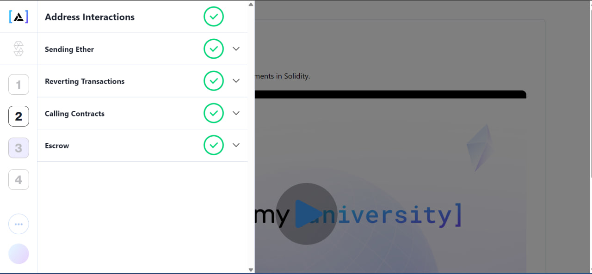

<p align="center">
  
</p>

# Module 2 — Address Interactions

This module covers address-to-address and contract-to-contract interactions in Solidity: receiving and sending Ether, reverting transactions to enforce access controls and manage execution state, calling external contracts using high-level interfaces and low-level `.call()`, and building a robust, secure decentralized multi-party Escrow agreement contract. Each exercise consists of Solidity contracts paired with Foundry unit tests.

---

## Table of Contents

- [Overview](#overview)
- [Project Structure](#project-structure)
- [Prerequisites](#prerequisites)
- [Setup](#setup)
- [Running the Tests](#running-the-tests)
- [Exercises](#exercises)
  - [Sending Ether](#sending-ether)
  - [Reverting Transactions](#reverting-transactions)
  - [Calling Contracts](#calling-contracts)
  - [Escrow](#escrow)
- [Learning Outcomes](#learning-outcomes)

---

## Overview

Module 2 is split into four thematic groups focused on managing state interactions and control flow:

| Group | Purpose |
|-------|---------|
| **sending-ether** | Practice receiving Ether via `receive()` and sending Ether via low-level `call{value: val}("")`, as well as contract lifecycle management with `selfdestruct`. |
| **revert-transaction** | Practice conditional state reverts using `require`/`revert` and implementing access control with custom modifiers. |
| **calling-contract** | Learn how to interact with external deployed contracts using both compile-time high-level interfaces and runtime dynamic low-level `.call()`. |
| **escrow** | Develop and test a secure, decentralized multi-party Escrow protocol to lock and release deposited funds. |

Each exercise is a fully working Solidity file paired with an automated Foundry test suite (`.t.sol` or `Test.sol`).

---

## Project Structure

```
module-2/
├── README.md
├── module-2.png
│
├── sending-ether/
│   ├── Part-1/              # Declaring state variables & owner setup
│   ├── part-2/              # Receiving Ether using receive()
│   ├── Part-3/              # Tipping and donating implementation
│   ├── Part-4/              # Target balance assertions
│   ├── Part-5/              # Verifying contract self-destruction
│   └── Part-6/              # selfdestruct contract destruction
│
├── revert-transaction/
│   ├── part-1/              # Enforcing minimum value in constructor
│   ├── part-2/              # Restricting withdrawals to the owner
│   └── part-3/              # Implementing reusable onlyOwner modifiers
│
├── calling-contract/
│   ├── part-1/              # High-level contract calls using interfaces
│   ├── part-2/              # Multi-parameter interface interactions
│   ├── part-3/              # Low-level .call() with signature encoding
│   ├── part-4/              # Forwarding arbitrary data payloads (relay)
│   └── part-5/              # Triggering fallback routines with mismatched selectors
│
└── escrow/
    ├── part-1/              # Declaring escrow roles (depositor, beneficiary, arbiter)
    ├── part-2/              # Setting roles via the constructor
    ├── part-3/              # Designing the arbiter approval and transfer logic
    ├── part-4/              # Declaring and emitting event logs
    ├── part-5/              # Enforcing security and access checks
    └── part-6/              # Finalizing the contract with comprehensive Foundry tests
```

Each leaf folder contains:
- `Contract.sol` (or `Hero.sol`/`Sidekick.sol`/`escrow.sol`) — the Solidity contract for that exercise.
- `ContractTest.sol` (or `Contract.t.sol`/`escrow.t.sol`) — the matching Foundry test file.

---

## Prerequisites

You will need:
- **[Foundry](https://book.getfoundry.sh/)** — the toolchain used for compiling and testing (`forge`, `cast`, `anvil`).
- **Git** — for cloning the repository.
- **A terminal** — PowerShell, Bash, or Windows Terminal.

### Install Foundry

**Linux / macOS / WSL:**
```bash
curl -L https://foundry.paradigm.xyz | bash
foundryup
```

**Windows (PowerShell):**
```powershell
irm https://foundry.paradigm.xyz | iex
foundryup
```

Verify the install:
```bash
forge --version
```

---

## Setup

1. **Navigate to the Module 2 directory**

   ```bash
   cd blockchain-assignment/Biniyam/module-2
   ```

2. **Initialize a Foundry project** (if `foundry.toml` does not already exist):

   ```bash
   forge init --no-commit --force
   ```

3. **Install Foundry standard library** (used by the test files):

   ```bash
   forge install foundry-rs/forge-std --no-commit
   ```

---

## Running the Tests

To run the tests for a specific part/exercise, navigate to its folder (configured as a Foundry project) or run from the root specifying the test file:

```bash
# Run all tests in the current project
forge test

# Run with verbose execution traces
forge test -vvv

# Run a specific test contract
forge test --match-contract ContractTest

# Run a specific test function
forge test --match-test testDonate
```

To compile all contracts without running tests:
```bash
forge build
```

---

## Exercises

### Sending Ether

| Exercise Part | File | Concept |
|---------------|------|---------|
| **Part-1** | `sending-ether/Part-1/Contract.sol` | Constructor initialization storing the owner address. |
| **part-2** | `sending-ether/part-2/Contract.sol` | Implementing the `receive() external payable` function to accept incoming Ether. |
| **Part-3** | `sending-ether/Part-3/Contract.sol` | Creating a `tip()` function that pays the owner, and a `donate()` function that transfers the balance to a charity using `.call{value: ...}("")`. |
| **Part-4** | `sending-ether/Part-4/Contract.sol` | Validating external target address balances when donating. |
| **Part-5** | `sending-ether/Part-5/Contract.sol` | Reviewing contract destruction patterns and bytecode cleanups. |
| **Part-6** | `sending-ether/Part-6/Contract.sol` | Executing the `selfdestruct(payable(charity))` statement to destroy the contract and transfer residual funds. |

### Reverting Transactions

| Exercise Part | File | Concept |
|---------------|------|---------|
| **part-1** | `revert-transaction/part-1/Contract.sol` | Using `require(msg.value >= 1 ether)` in a constructor to ensure minimum funding. |
| **part-2** | `revert-transaction/part-2/Contract.sol` | Restricting the `withdraw()` function to the owner and executing safe transfers. |
| **part-3** | `revert-transaction/part-3/Contract.sol` | Creating and using custom `onlyOwner` modifiers to protect configuration setter functions. |

### Calling Contracts

| Exercise Part | File | Concept |
|---------------|------|---------|
| **part-1** | `calling-contract/part-1/Sidekick.sol` | Calling external contracts with a typed interface: `IHero(hero).alert()`. |
| **part-2** | `calling-contract/part-2/Sidekick.sol` | Interfacing with contracts that consume parameters. |
| **part-3** | `calling-contract/part-3/Sidekick.sol` | Creating a low-level payload with `abi.encodeWithSignature("alert(uint256,bool)", ...)` and executing `.call()`. |
| **part-4** | `calling-contract/part-4/Sidekick.sol` | Forwarding arbitrary inputs dynamically using a generic `relay(address, bytes)` utility function. |
| **part-5** | `calling-contract/part-5/sidekick.sol` | Creating intentional selector mismatches (`hello()`) to invoke fallback routines. |

### Escrow

| Exercise Part | File | Concept |
|---------------|------|---------|
| **part-1** | `escrow/part-1/escrow.sol` | Defining public escrow roles: `depositor`, `beneficiary`, and `arbiter`. |
| **part-2** | `escrow/part-2/escrow.sol` | Initializing roles dynamically inside the constructor. |
| **part-3** | `escrow/part-3/escrow.sol` | Implementing the `approve()` execution flow to unlock locked funds. |
| **part-4** | `escrow/part-4/escrow.sol` | Creating and emitting the `Approved(uint256)` event to log transaction outcomes off-chain. |
| **part-5** | `escrow/part-5/escrow.sol` | Ensuring access security, restricting the approval step strictly to the `arbiter`. |
| **part-6** | `escrow/part-6/escrow.sol` | Performing comprehensive integration tests and verifying escrow outcomes. |

---

## Learning Outcomes

By completing Module 2 you will be comfortable with:
- Declaring `payable` constructors and `receive()` fallback functions to securely receive Ether.
- Utilizing modern `addr.call{value: val}("")` syntax to send Ether instead of outdated and vulnerable transfer statements.
- Applying proper assertions with `require` statements to perform conditional rollbacks of state transitions.
- Defining reusable execution filters using Solidity `modifiers` to consolidate authorization layers.
- Architecting high-level compile-safe integrations between multiple deployed contracts using custom `interface` declarations.
- Performing dynamic, low-level payloads assembly with `abi.encodeWithSignature` to delegate logic calls runtime.
- Emitting and asserting events inside tests to verify off-chain indexing logs.
- Executing contract teardown cleanups using the `selfdestruct` lifecycle statement.
- Constructing a fully functional decentralized **Escrow** protocol managing locking and releasing processes.

---

## Next Steps

Once you are comfortable with Module 2, move on to **`module-3`** which dives deeper into data structures, mappings, nested mappings, and complex arrays.
