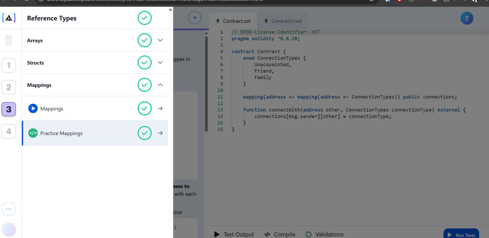

<p align="center">
  
</p>

# Module 3 — Reference Types

This module covers Solidity's reference and complex data structures: working with fixed-size and dynamic arrays, defining structured records using `struct`, leveraging efficient key-value storage with `mapping` (including nested mappings), and implementing stack-based clubs and voting protocols. Each exercise consists of Solidity contracts paired with Foundry unit tests.

---

## Table of Contents

- [Overview](#overview)
- [Project Structure](#project-structure)
- [Prerequisites](#prerequisites)
- [Setup](#setup)
- [Running the Tests](#running-the-tests)
- [Exercises](#exercises)
  - [Arrays](#arrays)
  - [Structs](#structs)
  - [Mappings](#mappings)
- [Learning Outcomes](#learning-outcomes)

---

## Overview

Module 3 is split into four thematic groups focused on reference types and state storage design:

| Group | Purpose |
|-------|---------|
| **Arrays** | Practice manipulating fixed and dynamic-size lists, allocating memory arrays dynamically via `new`, and implementing stack-based operations. |
| **Structs** | Learn to construct composite custom types to bundle related data, and manage arrays of structured entries. |
| **mapping** | Understand Solidity's hash table key-value registry, mapping addresses to structs, and architecting multi-layered nested mappings. |
| **practice** | Apply complex data model orchestrations combining arrays, structs, and mappings into multi-tiered state structures. |

Each exercise is a fully working contract paired with an automated Foundry test suite (`.t.sol`, `.test.sol`, or `Test.sol`).

---

## Project Structure

```
module-3/
├── README.md
├── module-3.png
│
├── Arrays/
│   ├── part 1/              # Fixed-size arrays (sum calculation)
│   ├── part 1/part 2/       # Dynamic-size arrays (sum calculation)
│   ├── part 3/              # Element filtering stored in a state array
│   ├── part 4/              # In-memory dynamic array allocation
│   ├── Part 5/              # Membership validation inside dynamic list
│   └── part 6/              # StackClub: member validation & pop operations
│
├── Structs/
│   ├── part 1/              # Bundle Voting choices and voter records inside structs
│   ├── part 2/              # Restricting duplicate voter submissions (reverts)
│   ├── part 3/              # Querying arrays of structs via search iterations
│   ├── part 4/              # Modifying in-place struct properties
│   ├── part 5/              # Event logging and state transitions
│   └── part 6/              # Comprehensive tests validating structural updates
│
├── mapping/
│   ├── part 1/              # Basic key-value membership registers
│   ├── part 2/              # Membership addition and verification
│   ├── part 3/              # State queries and access filters
│   ├── part 4/              # Mapping user addresses to composite structs
│   ├── part 5/              # Multi-user balance transfers with verification
│   └── part 6/              # Nested mappings mapping addresses to friends/family connections
│
└── practice/                # Integration playground for complex reference types
```

Each leaf folder contains:
- `Contract.sol` (or `stackClub.sol`/`constract.sol`/`contract.sol`) — the Solidity contract for that exercise.
- `ContractTest.sol` (or `Constract.t.sol`/`StackClub.t.sol`/`contract.test.sol`) — the matching Foundry test file.

---

## Prerequisites

You will need:
- **[Foundry](https://book.getfoundry.sh/)** — the toolchain used for compiling and testing (`forge`, `cast`, `anvil`).
- **Git** — for cloning the repository.
- **A terminal** — PowerShell, Bash, or Windows Terminal.

### Install Foundry

**Linux / macOS / WSL:**
```bash
curl -L https://foundry.paradigm.xyz | bash
foundryup
```

**Windows (PowerShell):**
```powershell
irm https://foundry.paradigm.xyz | iex
foundryup
```

Verify the install:
```bash
forge --version
```

---

## Setup

1. **Navigate to the Module 3 directory**

   ```bash
   cd blockchain-assignment/Biniyam/module-3
   ```

2. **Initialize a Foundry project** (if `foundry.toml` does not already exist):

   ```bash
   forge init --no-commit --force
   ```

3. **Install Foundry standard library** (used by the test files):

   ```bash
   forge install foundry-rs/forge-std --no-commit
   ```

---

## Running the Tests

To run the tests for a specific part/exercise, navigate to its folder (configured as a Foundry project) or run from the root specifying the test file:

```bash
# Run all tests in the current project
forge test

# Run with verbose execution traces
forge test -vvv

# Run a specific test contract
forge test --match-contract StackClubTest

# Run a specific test function
forge test --match-test testRemoveLastMember
```

To compile all contracts without running tests:
```bash
forge build
```

---

## Exercises

### Arrays

| Exercise Part | File | Concept |
|---------------|------|---------|
| **part 1** | `Arrays/part 1/Contract.sol` | Summing an array of fixed size `uint256[5]`. |
| **part 2** | `Arrays/part 1/part 2/Constract.sol` | Summing a dynamic array of `uint256[]`. |
| **part 3** | `Arrays/part 3/Constract.sol` | Iterating and copying even values to a state dynamic array. |
| **part 4** | `Arrays/part 4/Constract.sol` | Dynamically allocating arrays in memory using the `new` keyword and returning them from functions. |
| **Part 5** | `Arrays/Part 5/Constract.sol` | Creating a directory club using list searches to verify members. |
| **part 6** | `Arrays/part 6/stackClub.sol` | Implementing pop operations with `members.pop()` and restricting operations to existing club members. |

### Structs

| Exercise Part | File | Concept |
|---------------|------|---------|
| **part 1** | `Structs/part 1/constract.sol` | Creating custom structured types `Vote` and adding them to a list array. |
| **part 2** | `Structs/part 2/constract.sol` | Checking voter duplication to prevent multiple vote submissions. |
| **part 3** | `Structs/part 3/constract.sol` | Querying voting arrays sequentially to retrieve voter choices. |
| **part 4** | `Structs/part 4/constract.sol` | Modifying struct state values inside storage using `storage` references. |
| **part 5** | `Structs/part 5/constract.sol` | Emitting detailed events on vote changes and handling element cleanup. |
| **part 6** | `Structs/part 6/Constract.sol` | Writing integration validations for the voting lifecycle. |

### Mappings

| Exercise Part | File | Concept |
|---------------|------|---------|
| **part 1** | `mapping/part 1/contract.sol` | Declaring basic key-value `members` maps: `mapping(address => bool)`. |
| **part 2** | `mapping/part 2/contract.sol` | Performing write updates and status audits inside member mappings. |
| **part 3** | `mapping/part 3/contract.sol` | Querying status indicators directly without iterating. |
| **part 4** | `mapping/part 4/contract.sol` | Mapping user addresses directly to structured records: `mapping(address => User)`. |
| **part 5** | `mapping/part 5/contract.sol` | Moving balances between accounts securely by updating key values. |
| **part 6** | `mapping/part 6/contract.sol` | Implementing nested mappings for relational structures: `mapping(address => mapping(address => ConnectionTypes))`. |

---

## Learning Outcomes

By completing Module 3 you will be comfortable with:
- Differentiating between fixed-size and dynamic storage arrays.
- Allocating temporary dynamic arrays in memory using the `new` keyword and managing their fixed bounds during execution.
- Appending and removing array values using the highly optimized `push()` and `pop()` statements.
- Bundle relational data elements into cohesive schemas using the `struct` keyword.
- Distinguishing between `storage` and `memory` data reference pointers when mutating composite types.
- Initializing and reading high-performance key-value records using `mapping(key => value)`.
- Designing safe CRUD operations inside mapped registries to track user roles, balances, and permissions.
- Architecting hierarchical nested mapping structures to define advanced multi-dimensional relationships (e.g., social graphs).
- Resolving lookups and duplicate validation constraints securely to build voting systems and access-controlled groups.

---

## Next Steps

Once you are comfortable with Module 3, move on to **`module-4`** which covers advanced contract structures, inheritance, events, custom errors, and complete DApp system testing.
