# solution to task 1

// SPDX-License-Identifier: MIT
pragma solidity ^0.8.20;

contract Contract {
    bool public a = true;
    bool public b = false;
}

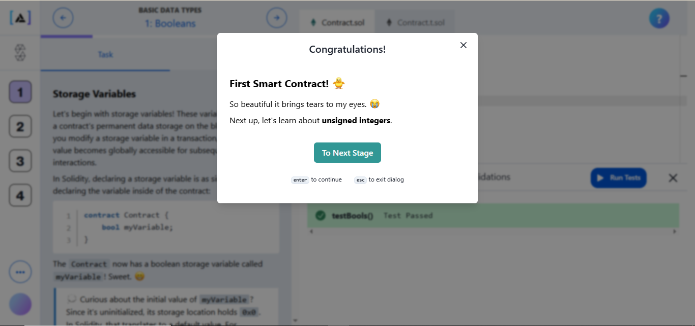

# solution to task 2

// SPDX-License-Identifier: MIT
pragma solidity ^0.8.20;

contract Contract {
    uint8 public a = 100;
    uint16 public b = 300;
    uint256 public sum = a + b;
}

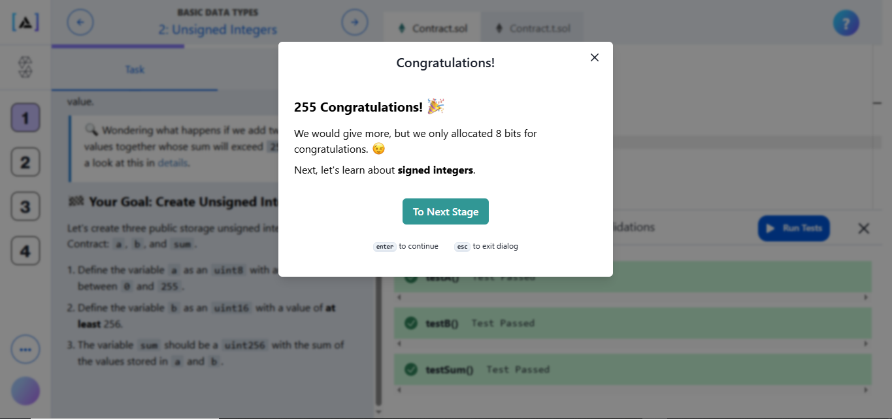

# solution to task 3

// SPDX-License-Identifier: MIT
pragma solidity ^0.8.20;

contract Contract {
    int8 public a = 20;
    int8 public b = -10;
    int16 public difference = a - b;
}

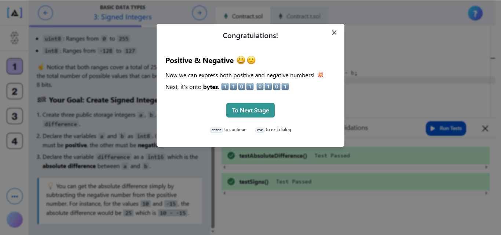

# solution to task 4

// SPDX-License-Identifier: MIT
pragma solidity ^0.8.20;

contract Contract {
    bytes32 public msg1 = "Hello World";
    
    string public msg2 = "This is a long string literal that requires more than thirty two bytes.";
}

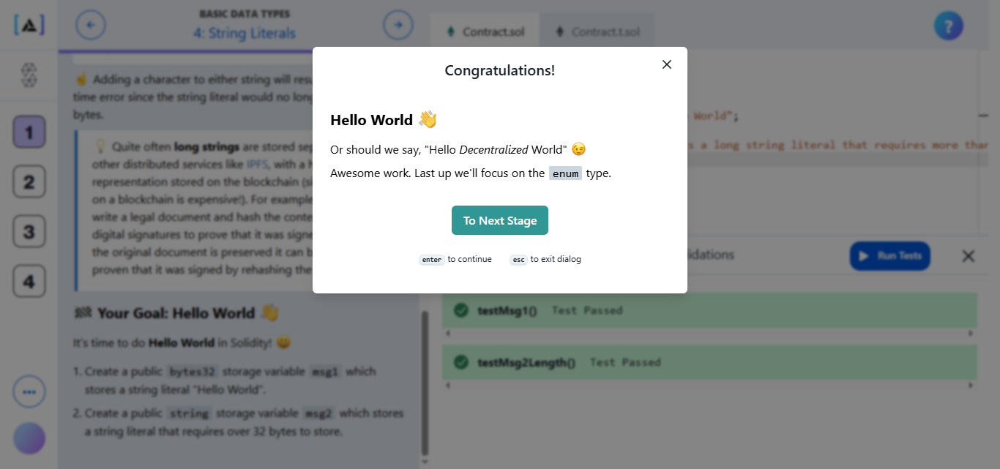

# solution to task 5

// SPDX-License-Identifier: MIT
pragma solidity ^0.8.20;

contract Contract {
    enum Foods { Pizza, Burger, Sushi, Tacos }

    Foods public food1 = Foods.Pizza;
    Foods public food2 = Foods.Burger;
    Foods public food3 = Foods.Sushi;
    Foods public food4 = Foods.Tacos;
}

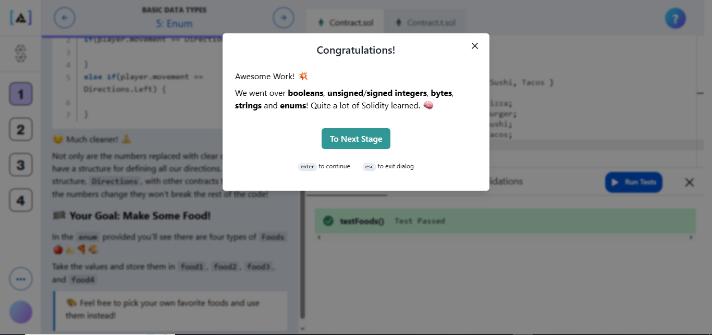

 # SOLIDITY FUNCTIONS
 ## solution to  1

 // SPDX-License-Identifier: MIT
pragma solidity ^0.8.20;

contract Contract {
    uint public x;

    constructor(uint _x) {
        x = _x;
    }
}

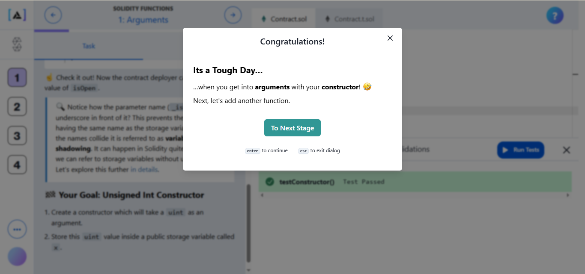

## solution to 2

// SPDX-License-Identifier: MIT
pragma solidity ^0.8.20;

contract Contract {
    uint public x;

    constructor(uint _x) {
        x = _x;
    }

    function increment() external {
        x += 1;
    }
}

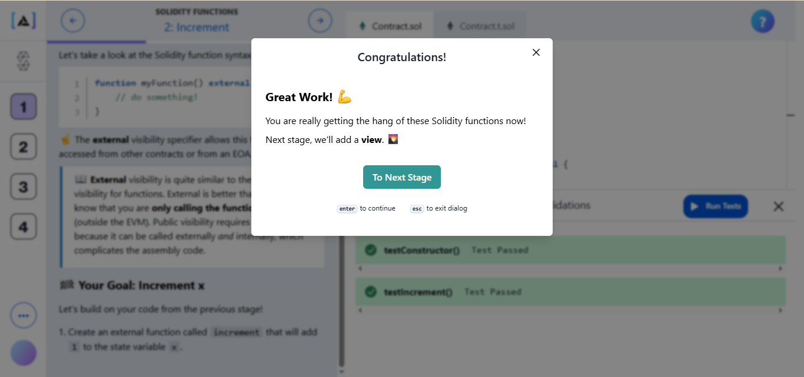

## solution to 3

// SPDX-License-Identifier: MIT
pragma solidity ^0.8.20;

contract Contract {
    uint public x;

    constructor(uint _x) {
        x = _x;
    }

    function increment() external {
        x += 1;
    }

    function add(uint _value) external view returns(uint) {
        return x + _value;
    }
}

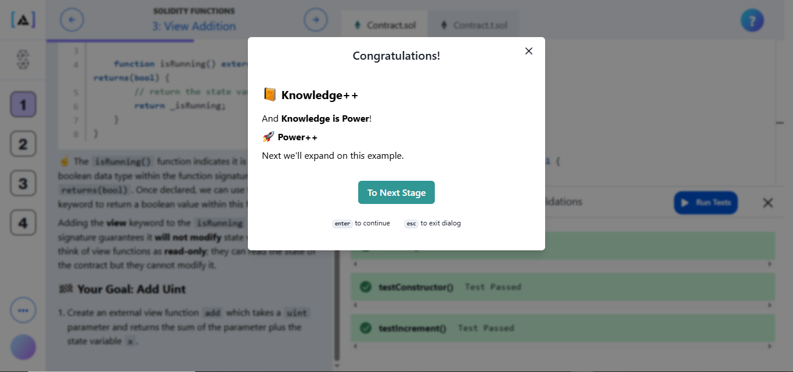

## solution to 4

here i tried this 

// SPDX-License-Identifier: MIT
pragma solidity ^0.8.20;

import "forge-std/console.sol";

contract Contract {
    function winningNumber(string calldata message) external returns(uint) {
        console.log(message);

        return 7;
    }
}

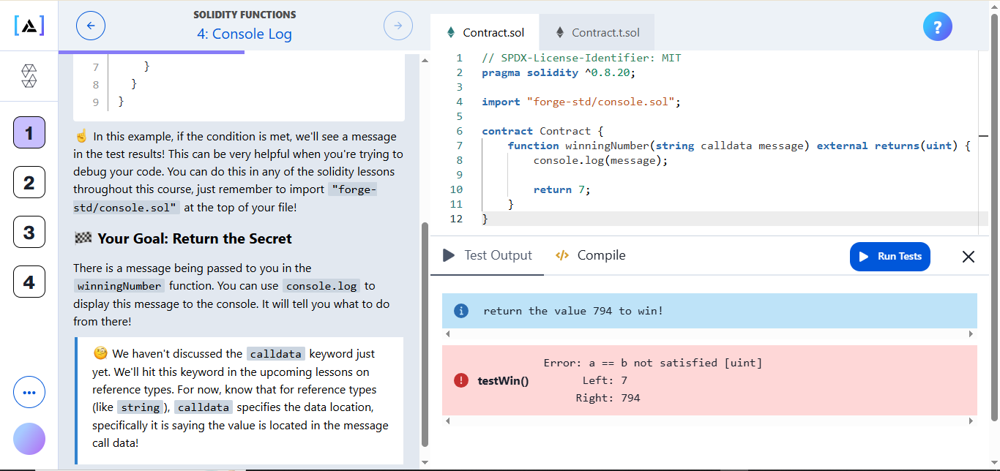

as you can see am wrong but the most important part is the console log which it says 794 so amma try that .

and just like changing 7 to 794 we got it correctly 

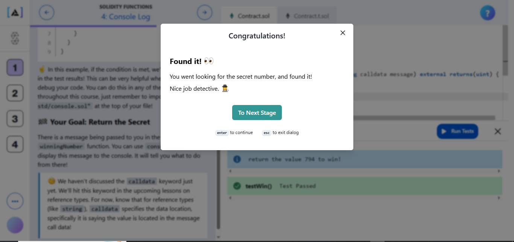

## solution to 5

// SPDX-License-Identifier: MIT
pragma solidity ^0.8.20;

contract Contract {
    function double(uint x) external pure returns(uint) {
        return x * 2;
    }
}

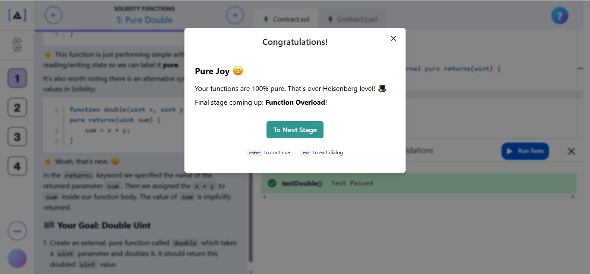

## solution to 6

// SPDX-License-Identifier: MIT
pragma solidity ^0.8.20;

contract Contract {
    function double(uint x) public pure returns(uint) {
        return x * 2;
    }

    function double(uint x, uint y) external pure returns(uint, uint) {
        return (double(x), double(y));
    }
}

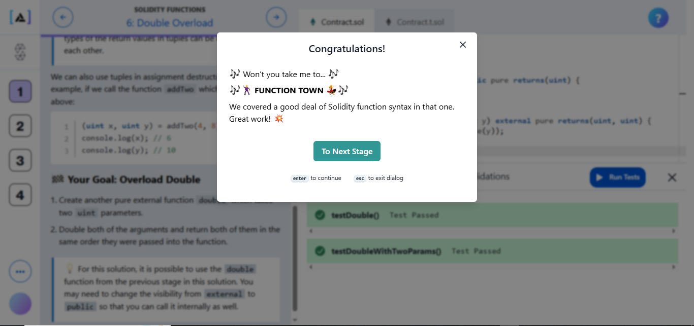