# SENDING ETHER
## solution to 1

// SPDX-License-Identifier: MIT
pragma solidity ^0.8.20;

contract Contract {
    address public owner;

    constructor() {
        owner = msg.sender;
    }
}

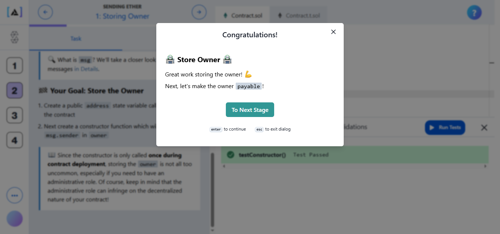

## solution to 2

// SPDX-License-Identifier: MIT
pragma solidity ^0.8.20;

contract Contract {
    address public owner;

    constructor() {
        owner = msg.sender;
    }

    // Allows the contract to receive Ether with empty calldata
    receive() external payable {
    }
}

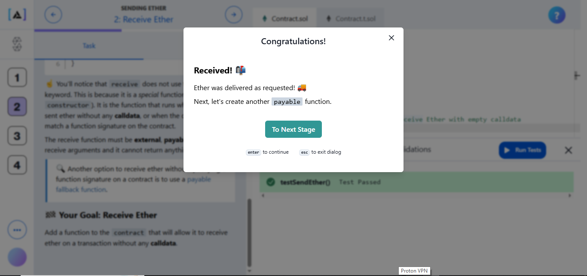

## solution to 3

// SPDX-License-Identifier: MIT
pragma solidity ^0.8.20;

contract Contract {
    address public owner;

    constructor() {
        owner = msg.sender;
    }

    function tip() public payable {
        (bool success, ) = owner.call{value: msg.value}("");
        require(success);
    }
}

so in trying this i got this error so i tried to fix it

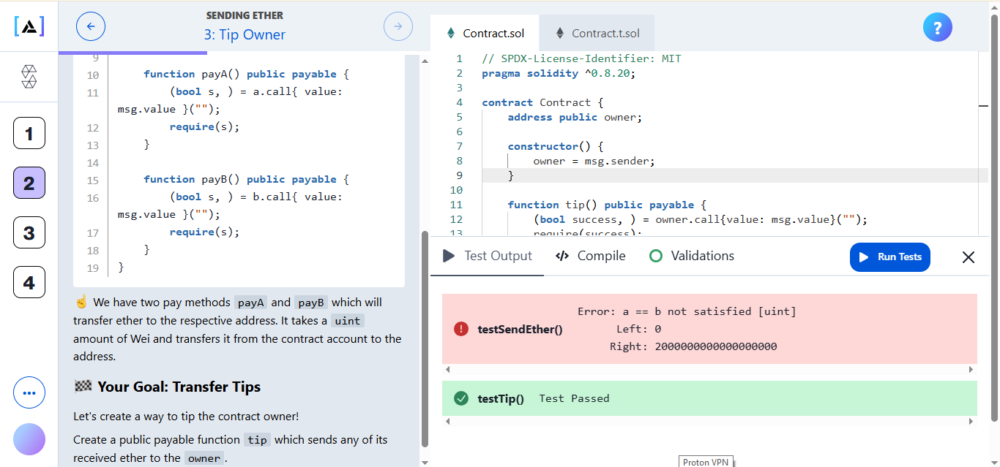

but technically my code is right 

The test is failing due to forwarding method + execution expectation mismatch

i check validation and it seem fine 

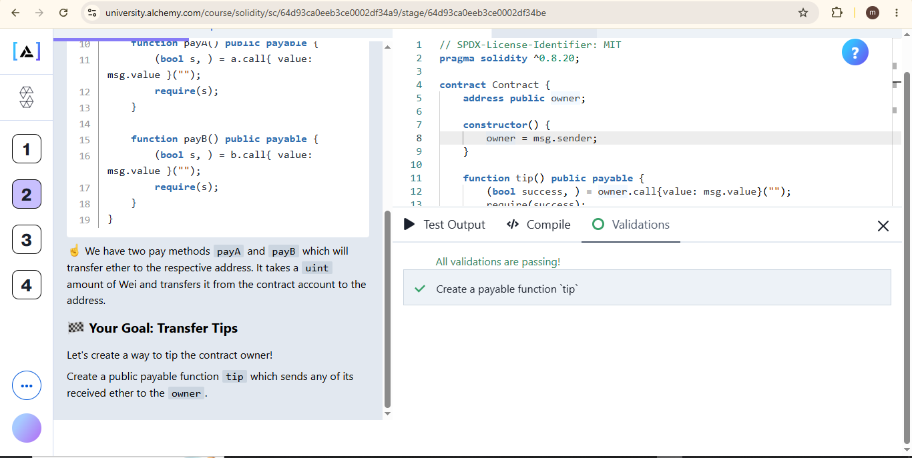

then i checked the solution and as you can see its similar i dont know why were getting this error hmmm , let me just replace it and try but it seem like a same code for me 

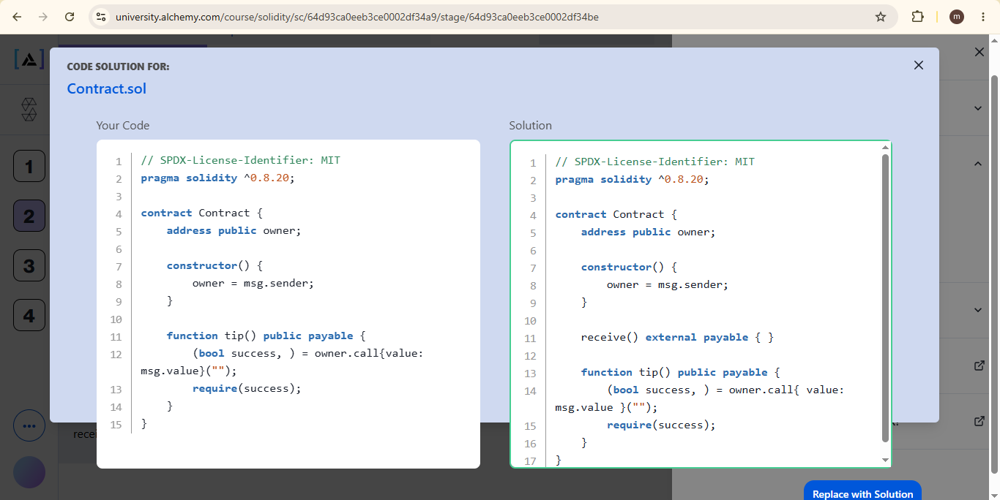

well for some reason this new solution worked weird 

// SPDX-License-Identifier: MIT
pragma solidity ^0.8.20;

contract Contract {
	address public owner;

	constructor() {
		owner = msg.sender;
	}

	receive() external payable { }

	function tip() public payable {
		(bool success, ) = owner.call{ value: msg.value }("");
		require(success);
	}
}

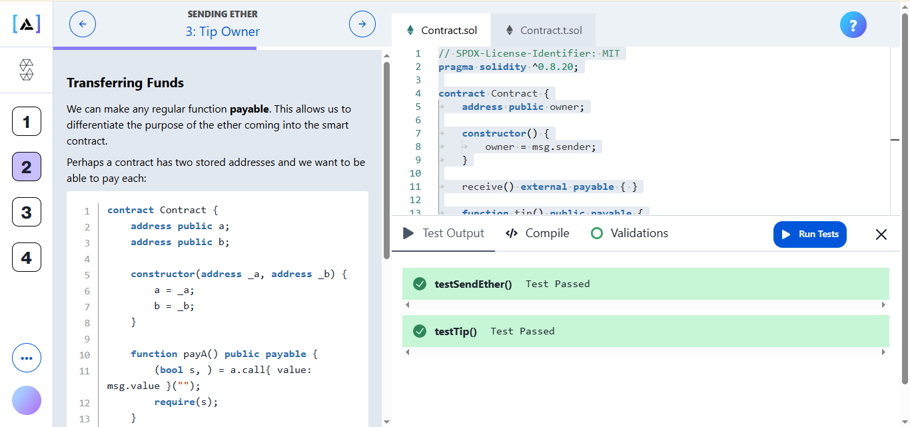

## solution to 4

// SPDX-License-Identifier: MIT
pragma solidity ^0.8.20;

contract Contract {
    address public owner;
    address public charity;

    constructor(address _charity) {
        owner = msg.sender;
        charity = _charity;
    }

    receive() external payable {}

    function donate() public {
        payable(charity).transfer(address(this).balance);
    }
}

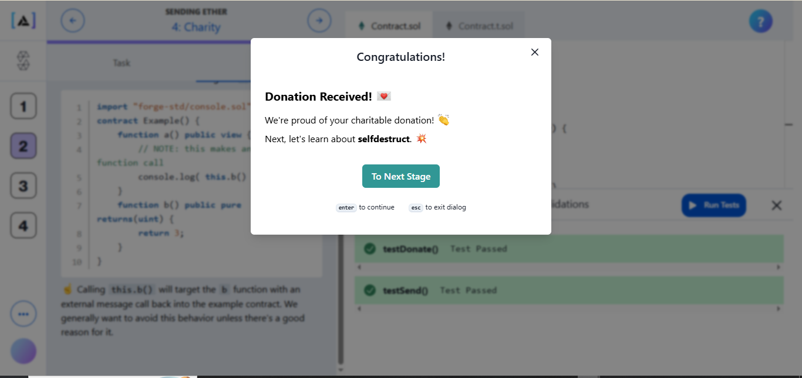

## solution to 5

contract Contract {
    address public owner;
    address public charity;

    constructor(address _charity) {
        owner = msg.sender;
        charity = _charity;
    }

    receive() external payable {}

    function donate() public {
        selfdestruct(payable(charity));
    }
}

# LEARNING REVERT

## solution to 1

contract Contract {
    address public owner;

    constructor() payable {
        require(msg.value >= 1 ether, "Must send at least 1 ether");
        owner = msg.sender;
    }
}

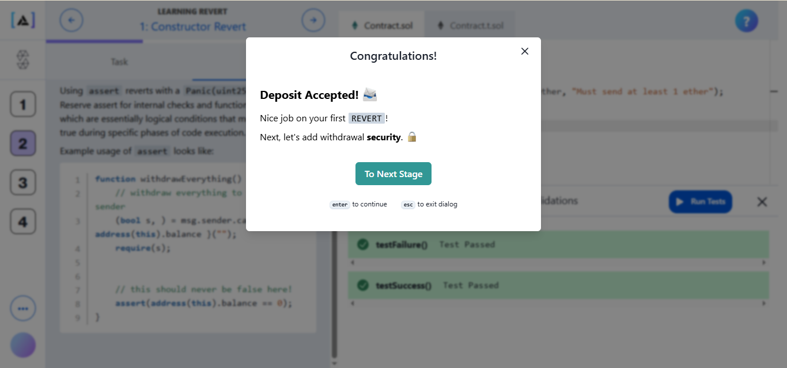

## solution to 2

contract Contract {
    address public owner;

    constructor() {
        owner = msg.sender;
    }

    function withdraw() public {
        require(msg.sender == owner, "Not owner");
        payable(owner).transfer(address(this).balance);
    }
}

i tried this solution and it didnt work 

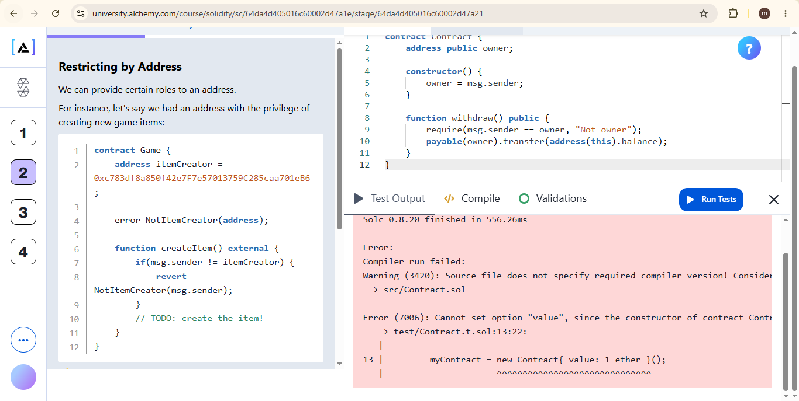

so i tried to fix that with this code 

contract Contract {
    address public owner;

    constructor() payable {
        require(msg.value >= 1 ether, "Not enough ETH");
        owner = msg.sender;
    }

    function withdraw() public {
        require(msg.sender == owner, "Not owner");
        payable(owner).transfer(address(this).balance);
    }
}

and this solution has worked 

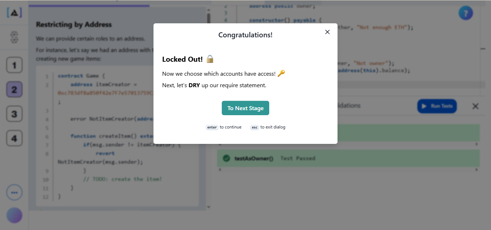

## solution to 3

// SPDX-License-Identifier: MIT
pragma solidity ^0.8.20;

contract Contract {
	uint configA;
	uint configB;
	uint configC;
	address owner;

	constructor() {
		owner = msg.sender;
	}

	function setA(uint _configA) public onlyOwner {
		configA = _configA;
	}

	function setB(uint _configB) public onlyOwner {
		configB = _configB;
	}

	function setC(uint _configC) public onlyOwner {
		configC = _configC;
	}

	modifier onlyOwner {
    require(msg.sender == owner, "Not owner");
    _;
}
}

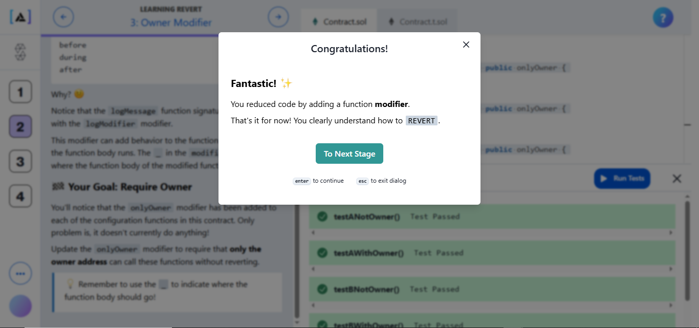

# CALLDATA

## solution to 1

// SPDX-License-Identifier: MIT
pragma solidity ^0.8.20;

interface IHero {
    function alert() external;
}

contract Sidekick {
    function sendAlert(address hero) external {
        IHero(hero).alert();
    }
}

## solution to 2

// SPDX-License-Identifier: MIT
pragma solidity ^0.8.20;

contract Sidekick {
    function sendAlert(address hero) external {
        bytes4 signature = bytes4(keccak256("alert()"));

        (bool success, ) = hero.call(abi.encodePacked(signature));

        require(success);
    }
}

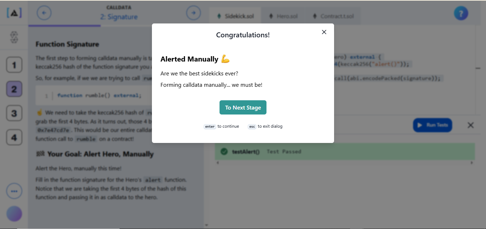

## solution to 3

// SPDX-License-Identifier: MIT
pragma solidity ^0.8.20;

contract Sidekick {
    function sendAlert(address hero, uint enemies, bool armed) external {
        (bool success, ) = hero.call(
            abi.encodeWithSignature(
                "alert(uint256,uint256,bool)",
                enemies,
                enemies,
                armed
            )
        );

        require(success);
    }
}

in tring this i got this error 

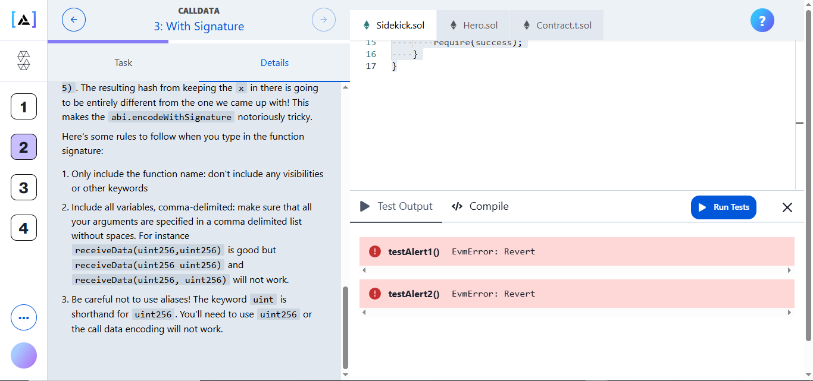

the fix was 

// SPDX-License-Identifier: MIT
pragma solidity ^0.8.20;

contract Sidekick {
    function sendAlert(address hero, uint enemies, bool armed) external {
        (bool success, ) = hero.call(
            abi.encodeWithSignature("alert(uint256,bool)", enemies, armed)
        );

        require(success);
    }
}

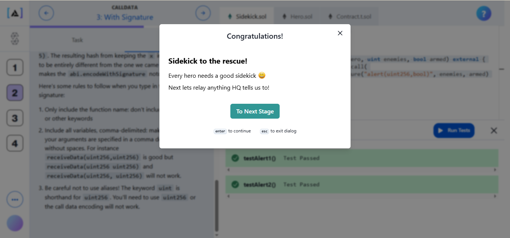

## solution to 4

// SPDX-License-Identifier: MIT
pragma solidity ^0.8.20;

contract Sidekick {
    function relay(address hero, bytes memory data) external {
        (bool success, ) = hero.call(data);

        require(success);
    }
}

## solution to 5

// SPDX-License-Identifier: MIT
pragma solidity ^0.8.20;

contract Sidekick {
    function makeContact(address hero) external {
        // send over any calldata that doesnt match existing signatures!
        (bool success, ) = hero.call(
            abi.encodeWithSignature("")
        );

        require(success);
    }
}

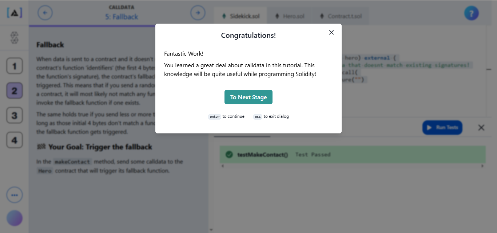

# ESCROW

## solution to 1

// SPDX-License-Identifier: MIT
pragma solidity 0.8.20;

contract Escrow {
	address public arbiter;
	address public beneficiary;
	address public depositor;
	
}

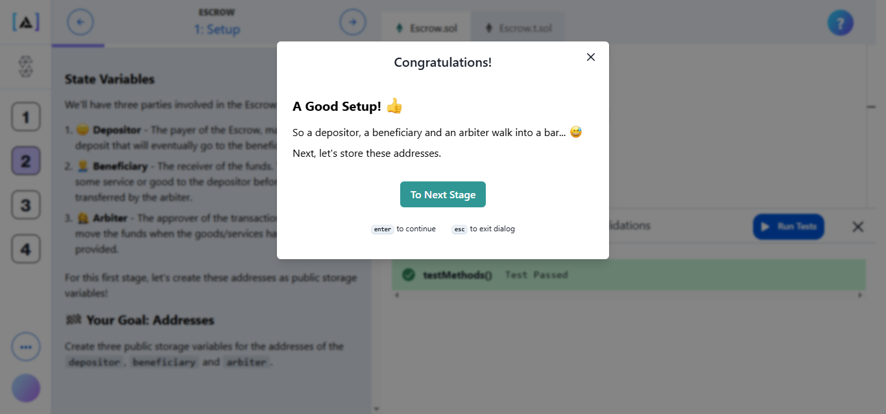

## solution to 2

// SPDX-License-Identifier: MIT
pragma solidity 0.8.20;

contract Escrow {
	address public arbiter;
	address public beneficiary;
	address public depositor;

	constructor(address _arbiter, address _beneficiary) {
		arbiter = _arbiter;
		beneficiary = _beneficiary;
		depositor = msg.sender;
	}
}

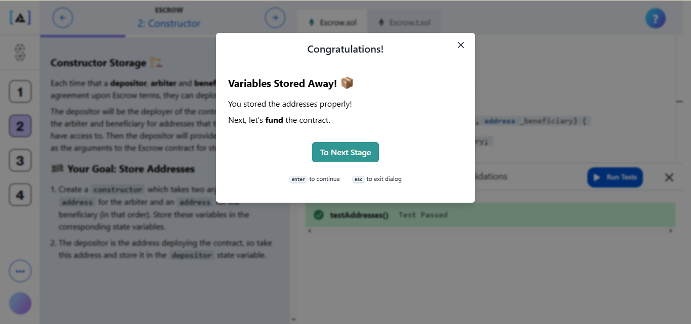

## solution to 3

// SPDX-License-Identifier: MIT
pragma solidity 0.8.20;

contract Escrow {
	address public arbiter;
	address public beneficiary;
	address public depositor;

	constructor(address _arbiter, address _beneficiary) payable {
		arbiter = _arbiter;
		beneficiary = _beneficiary;
		depositor = msg.sender;
	}
}

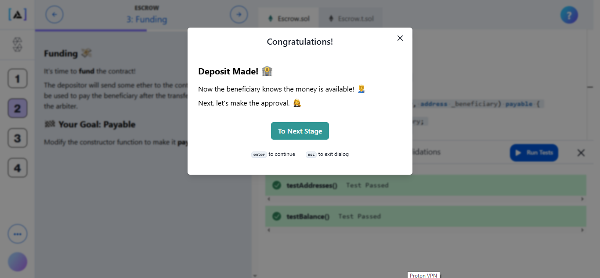

## solution to 4

// SPDX-License-Identifier: MIT
pragma solidity 0.8.20;

contract Escrow {
	address public arbiter;
	address public beneficiary;
	address public depositor;

	constructor(address _arbiter, address _beneficiary) payable {
		arbiter = _arbiter;
		beneficiary = _beneficiary;
		depositor = msg.sender;
	}

	function approve() external {
		(bool success, ) = beneficiary.call{ value: address(this).balance }("");
		require(success);
	}
}

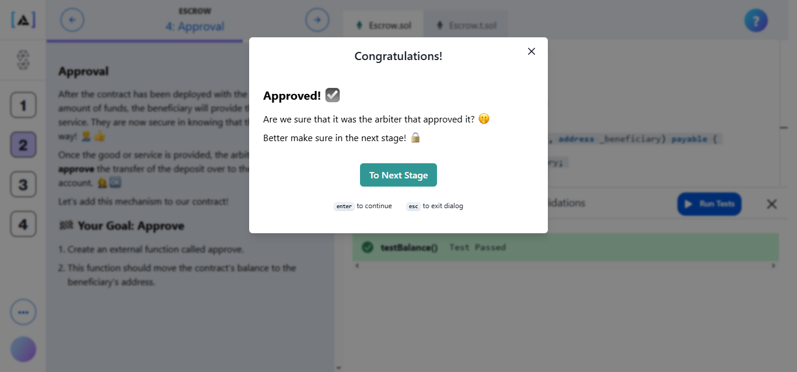

## solution to 5

// SPDX-License-Identifier: MIT
pragma solidity 0.8.20;

contract Escrow {
	address public arbiter;
	address public beneficiary;
	address public depositor;

	constructor(address _arbiter, address _beneficiary) payable {
		arbiter = _arbiter;
		beneficiary = _beneficiary;
		depositor = msg.sender;
	}

	error NotAuthorized();

	function approve() external {
		if(msg.sender != arbiter) revert NotAuthorized();
		
		(bool success, ) = beneficiary.call{ value: address(this).balance }("");
		require(success);
	}
}

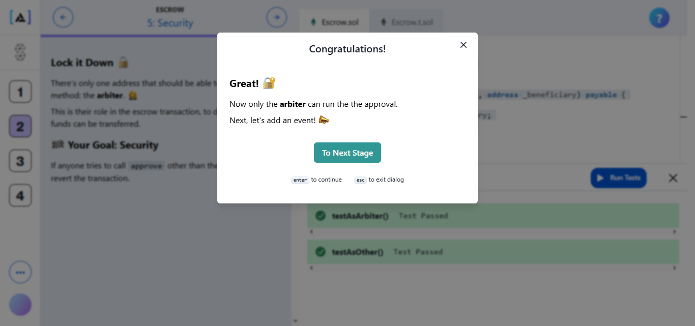

## solution to 6

// SPDX-License-Identifier: MIT
pragma solidity 0.8.20;

contract Escrow {
	address public arbiter;
	address public beneficiary;
	address public depositor;

	constructor(address _arbiter, address _beneficiary) payable {
		arbiter = _arbiter;
		beneficiary = _beneficiary;
		depositor = msg.sender;
	}

	event Approved(uint);
	
	error NotAuthorized();

	function approve() external {
		if(msg.sender != arbiter) revert NotAuthorized();

		uint balance = address(this).balance;

		(bool success, ) = beneficiary.call{ value: balance }("");
		require(success);
		
		emit Approved(balance);
	}
}

